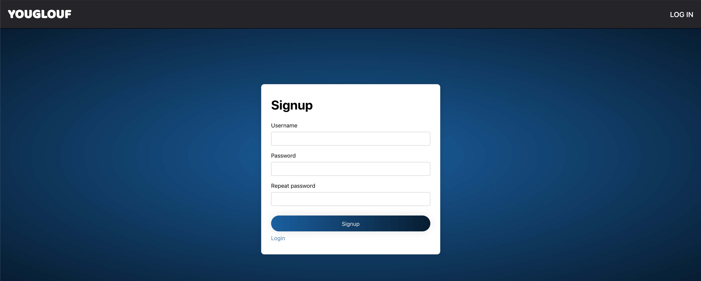

# SCALA Project - Youglouf

## Goal
Our project is a card game called Youglouf. Our goal is to implement Youglouf as a multiplayer video game written in SCALA.

## Youglouf
Youglouf is a __card game__ for 3 or more players.
It is usually played with a standard 52-card deck.
As most of card games, it is based on luck, but also requires some strategy skills.
Our goal is to create a web version of the game that would replace the real cards and allow playing Youglouf anywhere anytime.

### Rules
In the beginning of the game, every player receives 4 cards and can see 2 of them, but only __once__.
The rest of the cards are placed in the __closed deck__ in middle of the table.
Then the round begins. Every player plays once per round, in the clockwise order.
The card distributor starts the round:
* picks a card from the top of the closed or opened deck and watches it without showing to opponents
* decides whether he wants to replace one of his cards with the picked one or drop it
* drops the card (the newly picked or the replaced) to the __opened deck__ next to the closed one
* if any player has the card with the same rank, he can place it on top of the opened deck

*NOTE*:  if anyone reveals a wrong card (for example, tries to place a wrong card on the top of the opened deck), the punishment card is added to the player's card set, without revealing.

The goal of the game is to finish it with as little __points__ as possible.
The points are calculated as follows:

* from `2` to `10` points are equal to the rank
* `jack`: 11 points
* `queen`: 12 points
* `black king`: 13 points
* `ace`: 1 point
* `red king`: 0 points

So, `red kings` are the most "precious" cards of the game.

In addition, there are several __special cards__ allowing special features.
These features are applied only if the card is picked from the closed deck and directly dropped in the opened deck.
The __special cards__ and their features are listed below:

* `9` and `10`: the player can view one of his cards
* `jack`: the player can view the opponent's card of his choice
* `queen`: the player must exchange one of his cards with one of the opponent's cards, without revealing any of them

The __match finishes__ one round after one of the players declares a __Youglouf__ after finishing his turn.
Once the finish round is over, the points of all remaining cards are summed for each player.
If the player who declared Youglouf has the minimum match score, he earns -10 points.
If he has a match score equal to some other player's one, his score is calculated normally.
Otherwise, his score is equal to the accumulated score + 10.

*NOTE*: During the last round, all the players except the one who declared it cannot drop the last card of the card set, even if the card is of the same rank as on top of the opened deck.

The points of every match are accumulated until one of the players reaches the 100 points threshold.
The __winner__ of the game is the player having the minimum score.

## Implementation
Our main goal is to implement a multi-player game using WebSockets to maintain the state of the game across the different players and the server.
All accesses to the database (player registration, scores...) are made via a REST API using the Play framework.
We use the database to store the players data: score statistics, the users' profiles, etc.
Accesses to the REST API are secured with a Json Web Token (JWT).

### Technologies
* Backend: SCALA Play framework, REST API, JWT
* Frontend: React with Redux
* Database: MySQL acced by Slick

### Backend

#### Model
The Youglouf player is represented by the `Player` class. A player has a _name_ and a list
of `Card`s. A `Card` is defined by it's _Rank_ (from _two_ to _ace_) and it's _Suit_ (_spades_, _hearts_, _diamonds_ and _clubs_). The deck is defined in the `Deck` class and implemented as a stack of `Card`s. The `Deck52` object is the implementation of the classic 52-card deck.

The state of the game is stored in the `Game` Scala object. It manages the decks (opened and closed), the players, the order in which they play their turns and the actions they can perform during their turns.
The `Game` is composed of the `Match`es, which are composed of the `Rounds`, which are composed of the `Turn`s.
Once the players joined the game via _Game.addPlayer()_ or _Game.addPlayers()_ method, the match can be initiated with the _newMatch()_ method. The first `Round` and `Turn` are automatically created. The player starting the game is randomly chosen. During the player's turn, several methods of the `Game` object can be called in order to perform the player's actions:
* _pickCardFromOpenedDeck()_
* _pickCardFromClosedDeck()_
* _dropCardToOpenedDeck()_
* _replaceCard(index: Int)_
* _viewPlayersCard(target: Player, index: Int)_
* _exchangeCards(target: Player, hCardIndex: Int, tCardIndex: Int)_
* _declareLastRound()_

Once the player has finished his turn, the next `Turn` should be initiated with _Game.nextTurn()_ method.
Once the round is finished, the _Game.nextRound(first: Player)_
method should be called. The argument of this method is the player who will start the next round. The first player must be chosen depending on the game state: if the last round has been declared, the player starting the next round is the one right after. Otherwise, it must be the player next to the one who started the last round in the clockwise order. To check if the last round was declared, the _Game.lastRoundIsDeclared()_ can be called.
Once the match is finished, the new one can be launched with _Game.newMatch()_ method. The match must end after the last round was declared, then played. _Game.updateScores()_ method must be called after every match in order to add the match scores to the total ones. _Game.gameOver()_ method should be also called after each match to check if the game has finished (one of the players has reached the score above 100).

#### DAO
For each table of our MySQL database, we have a custom Slick DAO that provides all the necessary methods to perform basic CRUD operations.  

#### Database  
Below is the schema of our MySQL database:  
  

#### Routes
POST /users/login
user authentication with JSON payload of type: {"username": JohnDoe, "password": 1234}

POST /users/signup
user registration with JSON payload of type: {"username": JohnDoe, "password": 1234}

GET /user/statistics
query user statistics on games history, user is identified with the JWT provided in the header

GET /ws
establish the connection between the client and the server using WebSockets, the JWT is provided through the query string (URL parameters)

#### Security
In order to secure the critical routes of our REST API, we used the JWTs (Json Web Tokens). They are generated from the user's username and password. This way, when a user accesses a secured route, we can identify him by decoding the JWT and thus retrieving the username and password.
To implement this functionality, we had to create a `securedAction` class which extends `ActionBuilder`. When the user tries to access the secured route, his token is checked by it, and, if the token is proven to be valid, the request is forwarded to the next step. Otherwise an error is sent back to the client.
In addition to this, the websocket is secured in a similar manner.

### Frontend
The frontend of our application is implemented in **React** in addition to which **Redux** was used to manage the state. Redux allows us to maintain a global application state, useful for the authentication and easily managing the user's state from anywhere in the application.

First of all, one has to sign up to the Youglouf app:

Then he/she has to log in to the app. When doing so, the client will be provided with a Json Web Token (JWT):

When the client is in possession of the token, he will automatically be redirected to the lobby from where a secure two-way connection will be established with the server by opening a `WebSocket`. In the lobby, the user can press the `JOIN GAME` button to notify that he is ready to play:

Once the number of players reaches 4, the game starts and the user is automatically redirected on the game's page:

*Note:* the game shown above does not correspond to the final version
